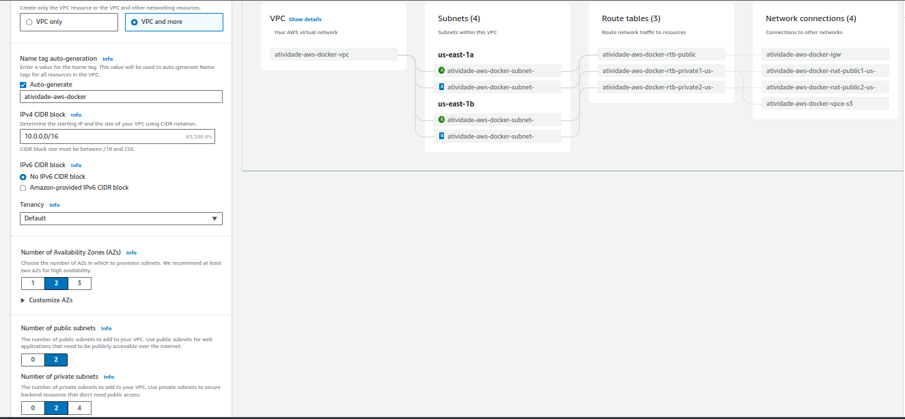
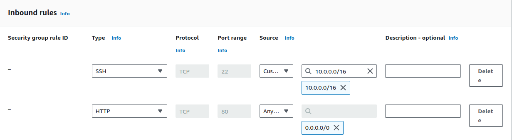

# Atividade AWS & Docker CompassUOL

## Requisitos

+ Instalação e configuração do DOCKER ou CONTAINERD no host EC2
    + Ponto adicional para o trabalho utilizar a instalação via script de Start Instance (user_data.sh)
+ Efetuar Deploy de uma aplicação Wordpress com:
    + Container de aplicação
    + RDS database Mysql
+ configuração do serviço de Load Balancer AWS para a aplicação Wordpress

### Topologia do projeto

### Pontos de atenção

+ Não utilizar ip público para saída do serviços WP (Evitem publicar o serviço WP via IP público)
+ Sugestão para o tráfego de internet sair pelo LB (Load Balancer Classic)
+ Pastas públicas e estáticos do wordpress sugestão de utilizar o EFS (Elastic File Sistem)
+ Fica a critério de cada integrante usar Dockerfile ou Dockercompose
+ Necessário demonstrar a aplicação wordpress funcionando (tela de login)
+ Aplicação Wordpress precisa estar rodando na porta 80 ou 8080
+ Utilizar repositório git para versionamento
+ Criar documentação

## Parte Prática

### 1 - Criando a VPC
O primeiro passo será criar uma VPC para este projeto. Essa VPC terá dois pares de subnets. Cada par será constituído por uma subnet privada e outra pública, e cada par estará em uma AZ diferente.

Um NAT Gateway será adicionado com o propósito de prover conexão com a internet.

### 2 - Criando os Security Groups
Regras para as instâncias EC2

