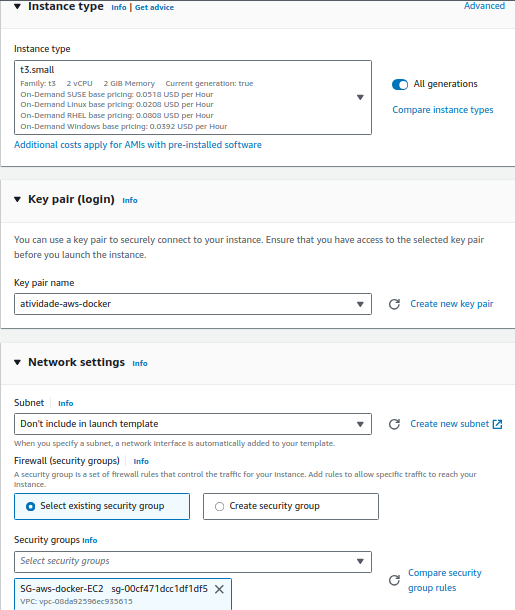

# Atividade AWS & Docker CompassUOL

## Requisitos

+ Instalação e configuração do DOCKER ou CONTAINERD no host EC2
    + Ponto adicional para o trabalho utilizar a instalação via script de Start Instance (user_data.sh)
+ Efetuar Deploy de uma aplicação Wordpress com:
    + Container de aplicação
    + RDS database Mysql
+ configuração do serviço de Load Balancer AWS para a aplicação Wordpress

### Topologia do projeto


### Pontos de atenção

+ Não utilizar ip público para saída do serviços WP (Evitem publicar o serviço WP via IP público)
+ Sugestão para o tráfego de internet sair pelo LB (Load Balancer Classic)
+ Pastas públicas e estáticos do wordpress sugestão de utilizar o EFS (Elastic File Sistem)
+ Fica a critério de cada integrante usar Dockerfile ou Dockercompose
+ Necessário demonstrar a aplicação wordpress funcionando (tela de login)
+ Aplicação Wordpress precisa estar rodando na porta 80 ou 8080
+ Utilizar repositório git para versionamento
+ Criar documentação

## Parte Prática

### 1 - Criando a VPC
O primeiro passo será criar uma VPC para este projeto. Essa VPC terá dois pares de subnets. Cada par será constituído por uma subnet privada e outra pública, e cada par estará em uma AZ diferente.

A princípio, a configuração inicial da VPC será essa:


Um NAT Gateway será adicionado com o propósito de prover conexão com a internet. Para criar, basta nevagar até `NAT Gateways`

Para prover conexão para uma sub-rede privada, o NAT Gateway precisará ser anexado a uma sub-rede pública:


Após a criação do NAT Gateway, foi necessário alterar as rotas. Naveguei até `Route Tables`, selecionei cada uma das sub-nets privadas, adicionei uma rota para `0.0.0.0/0` com um target no `Nat Gateway`, e selecionei o NAT Gateway criado.


A configuração final da VPC ficou assim:


### 2 - Criando os Security Groups
Criando as regras para os SGs. Basta navegar para EC2 e selecionar `Security Groups`

#### SG-LB
|Type |Protocol |Port Range|Source    |
|-----|---------|----------|----------|
|HTTP |TCP      |80        |0.0.0.0/0 |


#### SG-EC2
|Type |Protocol |Port Range|Source    |
|-----|---------|----------|----------|
|HTTP |TCP      |80        |SG-LB     |
|SSH  |TCP      |22        |0.0.0.0/0 |

#### SG-EFS
|Type |Protocol |Port Range|Source    |
|-----|---------|----------|----------|
|NFS  |TCP      |2049      |0.0.0.0/0 |

#### SG-RDS
|Type          |Protocol |Port Range|Source    |
|--------------|---------|----------|----------|
|MYSQL/Aurora  |TCP      |3306      |0.0.0.0/0 |

### 3 - Criação do EFS
Utilizei o EFS para compartilhar diretórios do container do Wordpress.

Para criar um EFS, cliquei em `Create files system` preenchi os campos de `nome`, `VPC` e, em seguida cliquei em `customize`.


A primeira parte foi deixada como padrão, a segunda apenas alterei os `Security groups` para o `SG-EFS`, nas outras partes eu também deixei como padrão.


### 4 - Criando o RDS
Busquei por RDS e cliquei em `Create database`. Em `engine`, selecionei `MySQL` e em `templates` selecionei `free tier`.

 


Em `Settings` apenas alterei o `DB instance identifier` e adicionei uma senha para o usuário master.


Em `Connectivity` apenas alterei os security groups e a AZ.


Em `Database options` adicionei o nome inicial do banco de dados.


### 5 - Criando um template para as instâncias
Optei por utilizar um template para facilitar a criação e configuração das instâncias. O template terá as seguintes configurações:

+ Máquina: Amazon Linux
+ Tipo da instância: t3.small
+ Utilizará o arquivo de configuração [`user_data.sh`](https://github.com/mateussgubim/atividade-aws/blob/main/user_data.sh)

Será necessário a utilização de uma chave para realizar a conexão SSH, para a criação, foram utilizados os seguintes comandos:

```
aws ec2 create-key-pair \
    --key-name atividade-docker \
    --query 'KeyMaterial' \
    --output text > atividade-docker.pem \
	--profile m
```

 